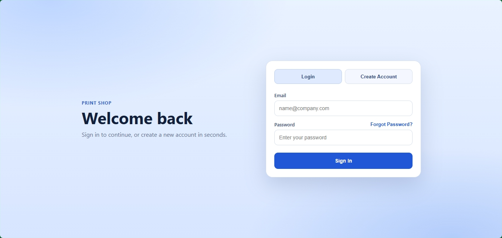
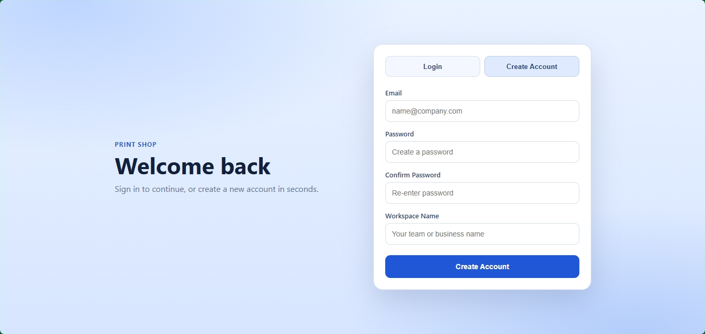

# auth-login-asp

ASP.NET Core 9 auth service with static frontend pages for login, registration, email verification, and password reset.

## Current Auth UX
- Login and Create Account are on `index.html`.
- Email verification uses a 6-digit code input panel on login.
- Forgot Password opens a separate page: `forgot-password.html`.
- Forgot password flow:
1. Enter email
2. Send code
3. Enter 6-digit reset code in 6 boxes
4. Auto-verify after full code input
5. Card flips to new-password form
6. Submit new password
7. Auto-redirect back to login
- Legacy `/reset-password` page now redirects to the new forgot-password flow.

## UI Preview




## Tech Stack
- .NET 9 (`net9.0`)
- ASP.NET Core Web API + static file hosting
- EF Core + Pomelo MySQL provider
- JWT access tokens + refresh token cookie
- Optional Redis for cache/rate-limit/session validation
- MailKit for SMTP email sending

## Prerequisites
- .NET SDK 9
- MySQL 8+
- Optional Redis

## Configuration
App settings are in:
- `AuthService/appsettings.json`
- `AuthService/appsettings.Development.json`

Environment variables can be loaded from `.env`:
- `AUTH_DB_CONNECTION` (recommended)
- `MYSQL_ROOT_PASSWORD` (optional replacement if connection string uses `your_password`)

Example template: `AuthService/.env.example`.

Important placeholders to set:
- `Jwt:Keys:0:SecretBase64`
- `Security:Pepper`
- DB connection values
- SMTP values under `Email` if you want real email delivery

## Run Locally
From repo root:

```bash
dotnet restore
dotnet run --project AuthService/AuthService.csproj --launch-profile https
```

Default local URLs:
- App/UI: `https://localhost:7023/index.html`
- Swagger: `https://localhost:7023/swagger`

## API Endpoints (Auth)
Base route: `/auth`

- `POST /register`
- `POST /verify-email`
- `POST /resend-verification-code`
- `POST /login`
- `POST /refresh`
- `POST /logout`
- `GET /me`
- `POST /forgot-password`
- `POST /verify-reset-code`
- `POST /reset-password`

## Code-Based Verification Notes
- Email verification and password reset both use 6-digit codes.
- Reset and verification emails are code text, not links.
- In development with `NoopEmailSender`, debug codes are returned in API responses:
  - `register -> verificationCode`
  - `resend-verification-code -> verificationCode`
  - `forgot-password -> resetCode`
